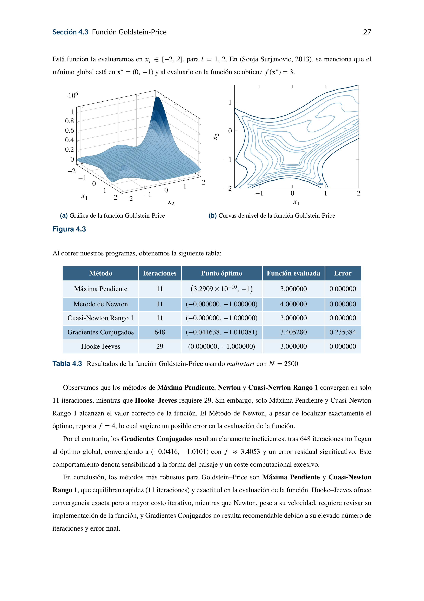

## Proyecto Final de Optimización No Lineal

**Autores:**  
- Marco Antonio Molina Mendoza  
- Sabdi Rivera Tavera  
- Jessica Beatriz Arcos Gutiérrez  
- Angelica Velazquez Rodriguez  

**Fecha:** 16 de junio de 2025

## Descripción

Este documento presenta un estudio comparativo de cinco métodos de optimización sin restricciones:

1. Descenso por Máxima Pendiente (Cauchy)  
2. Método de Newton  
3. Métodos Cuasi-Newton (rango uno)  
4. Gradientes Conjugados  
5. Algoritmo de Hooke–Jeeves (Apéndice A)  

Se implementan en MATLAB con técnica **multistart** de 2500 puntos iniciales para siete funciones de prueba:

- Bohachevsky  
- Booth  
- Goldstein–Price  
- Matyas  
- Three-Hump Camel  
- Easom  
- Beale  

Los resultados incluyen número de iteraciones, valor óptimo, error y análisis comparativo.
